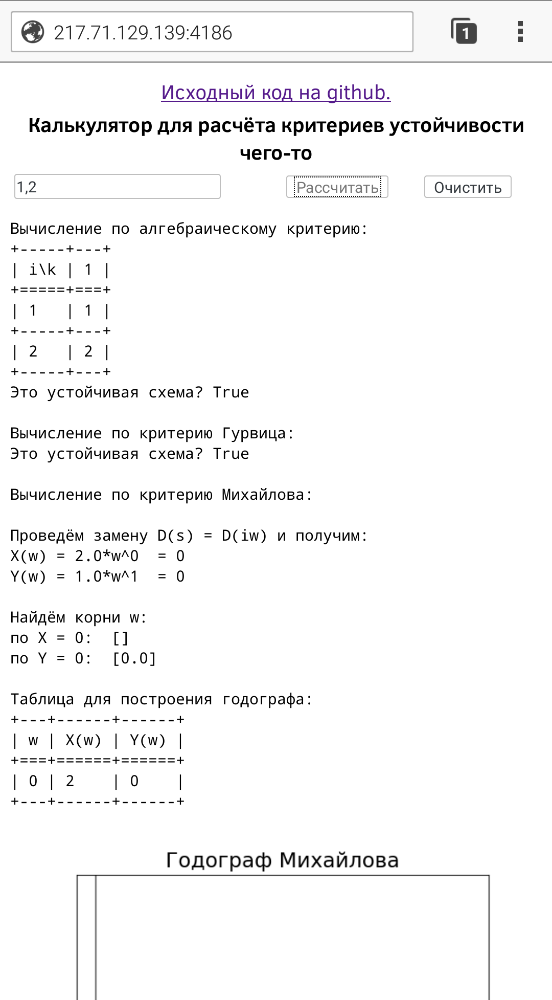

# Математическое моделирование управляемых систем

# Инструкция по запуску

## Установка зависимостей

Если у вас нет python и pip, то установить его можно следующей командой:
```
sudo apt install python3-pip
```

Так же у вас может быть не усчтановлен пакет для программы `fuser`, которая убибвает все процессы, использующие определённый порт, тогда надо установить:
```
psmisc
```

Далее требуются зависимости:
```
sudo pip3 install numpy
sudo pip3 install texttable
sudo pip3 install matplotlib
sudo pip3 install texttable
```

А ещё программа `nginx`:
```
sudo apt install nginx
```

## Запуск веб-сервиса

Веб-сервис имеет такие особенности, как:
* Вычисление критериев, введённых через текстовое поле
* Вычисление произвольной картинки на лету
* Адаптирован под экран телефона



Веб-сервис находится в файле `criterions_server.py`, он использует `print_server.py`, который можно легко по аналогии переиспользовать в других проектах.

Для вывода `html`, `js`, `css` и прочего статического содержимого используется `nginx`.

Для единичного запуска для тестов смотри раздел `Тестирование`, а для запуска на постоянной основе, чтобы сервер работал после закрытия ssh сессии, смотри раздел `Деплой`.

### Как вести разработку

Должно быть несколько директорий:
* Продакшен
* Тестинг

В продакшене код не должен изменяться локально, он должен поступать только через git. При этом скрипты деплоя не позволяют вести в нём разработку (совершая `git reset --hard`)

### Предварительные настройки

* **Отключить прослушивание 80 порта в nginx:**
	В файле `/etc/nginx/sites-enabled/default` заменяем `80` на какой угодно не используемый порт, например: `79` в следующих строках:
	```
	server {
		listen 80 default_server;
		listen [::]:80 default_server;
	``` 
* **Добавить конфигурации для сервера:**
	В файле `/etc/nginx/nginx.conf` добавляем строки внутри окружения `http`:
	```
	include <absolute path to production>/conf/prod.nginx.conf;
	include <absolute path to testing>/conf/test.nginx.conf;
	```
* **Правим конфиги**
	В `conf/prod.nginx.conf` вместо `root /root/production/www;` указываем `root <абсолютный путь до папки www в репозитории>;`.
* **Разбираемся с правами**
	В файле `/etc/nginx/nginx.conf` в самом начале заменяем строку `user www-data;` на `user root;`. Конечно, правильней было бы добавить `root` в группу `www-data`, но можно и так, плохо поступить.
* **Модифицируем конфиг демона**
	В файле `conf/calculator.service` надо заменить `<absolute_path>` на абсолютный путь к продакшеновой папке репозитория.
* **Помещаем конфиг демона в нужное место**
	Копируем файл `conf/calculator.service` в директорию `/etc/systemd/system/`.

### Тестирование

В папке для тестирования разработку можно вести. Чтобы проверить на работоспособность, надо запустить `./test`, этот скрипт делает следующее:
* Освобождает занятый порт для демона калькулятора
* Проверяет, что текущий репозиторий имеет самые последние изменения, если это не так, не позволяет запуститься (необходимо, чтобы при коммите не возникали конфликты, философия trunk-based-development)
* Запускает программу для тестинга на `6667` порт.

Перед выкаткой в продакшен (деплоем), необходимо запустить тестинг и убедиться, что всё работает.

### Деплой

Для деплоя предназначен скрипт `./deploy`, который:
* Отменяет все локальные изменения
* Скачивает последнюю версию из репозитория
* Останавливает текущего демона, реализующего сервер
* Запускает демона с изменённым кодом
* Выводит статус
* При помощи curl'а проверяет, что всё работает
* Снова выводит статус

При этом существуют вспомогательные скрипты:
* `start`
* `stop`
* `status`
* `reload_nginx`

Которые работают с демоном этого веб-сервиса.

Демон создаётся при помощи стандартной утилиты `systemctl`.
